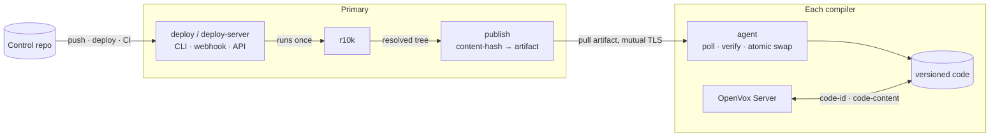

# codavox

[](https://github.com/miharp/codavox/actions/workflows/ci.yml)
[](https://github.com/miharp/codavox/actions/workflows/integration.yml)
[](https://github.com/miharp/codavox/releases)
[](LICENSE)

**Code Manager and file sync for open-source OpenVox: versioned Puppet code
distribution, and static catalogs that actually work.**

codavox gets your Puppet code onto every node that compiles catalogs, and lets
each one report exactly which version it is serving. You deploy from your
control repo the way you already do; codavox makes sure every one of those nodes
ends up serving identical, fully resolved code, and can prove which version that
is. That holds for fifty compilers, and for a
[single OpenVox Server](docs/production.md#a-primary-that-compiles-its-own-catalogs),
where static catalogs stay inert until something answers for the code version.
OpenVox ships the hook, but nothing that fills it.

**Status: early development.** The whole chain works and is exercised on every
push to `main` against real OpenVox Server processes: a deploy runs r10k and
distributes the result, a compiler that missed a deploy catches up on its own,
an agent receives a catalog stamped with the exact code version, and revoking a
compiler's certificate cuts off its access to code. The one place untrusted
bytes are parsed (unpacking a downloaded artifact) is fuzzed nightly.

It ships as rpm and deb for `linux/amd64` and `linux/arm64`, with systemd units
and a Puppet module ([miharp/puppet-codavox](https://github.com/miharp/puppet-codavox))
to configure it. What "early" still means: no package repository, so installs
are by URL; the version numbers are `0.x` and the on-disk layout may yet change;
and it has not run anywhere but a test estate.

## Coming from Puppet Enterprise?

If you have run Code Manager, you already know the model. codavox is the same
shape for open-source OpenVox Server, which ships the hook file sync relies on,
but not file sync or Code Manager themselves.

| In Puppet Enterprise | In codavox |
|---|---|
| `puppet-code deploy production` | `codavox deploy production` |
| Code Manager webhook and API | `codavox deploy-server` (push webhook + `POST /v1/deploys`) |
| file sync, primary → compilers | `codavox publish` on the primary, `codavox agent` on each compiler |
| static catalogs and their `code_id` | the same: codavox implements the same contract |
| Code Manager runs r10k centrally | codavox runs r10k too, then distributes the result |

The main difference: compilers **pull** (poll) rather than being pushed to, so a
compiler that was offline during a deploy catches up on its own, with no event to
replay and no way to silently miss one.

## A few terms

- **Environment**: a named set of Puppet code, such as `production`, built from
  a branch of your control repo. As everywhere in Puppet.
- **Static catalog**: a Puppet feature that keeps an agent's file content
  matched to the catalog it was compiled against, even if the code changes
  mid-run. See [Static catalogs in plain terms](#static-catalogs-in-plain-terms).
- **`code_id`**: the identifier for that exact version. In codavox it is a
  content hash of the fully resolved code, so identical code always has the same
  `code_id`, on every compiler.
- **Publisher and agent**: the publisher runs on your primary and serves
  versioned code; the agent runs on each compiler and pulls it.

## Static catalogs in plain terms

Puppet configures a node from a **catalog**, the full list of what that node
should have: packages, services, files, and so on. Much of a catalog is files
copied from your modules, and the agent fetches those file contents from the
server as it works through the catalog.

An agent run takes time. If you deploy new code *while* a run is in progress,
the agent can fetch the new version of a file partway through and apply a mix
of old and new: a silent, hard-to-debug inconsistency.

A **static catalog** prevents that. When the catalog is compiled, the server
stamps it with a version (the `code_id`) and the checksums of the module files
it uses. For the rest of that run the agent asks for files *at that version*, so
it always gets the set that matches the catalog it was handed, even if you
deploy in the middle. (It covers module file *content*, not the whole catalog.)

For this to work, the server has to answer two questions on demand: **which
version is current?** and **give me file X at version Y.** Puppet Enterprise
answers them with Code Manager and file sync. A stock OpenVox Server has the
socket for these answers but nothing plugged into it, so it asks for a version,
gets nothing back, and the guarantee quietly does nothing.

You can fill that socket yourself, and the obvious way is git: report the commit
SHA as the version, and serve content with `git show <sha>:<path>`. That holds up
until a file resource points into a module r10k installed from your Puppetfile,
which is every Forge module you use and anything you pull from another repo.
Those files are in no commit of your control repo, so git has nothing to hand
back. Answering for them means keeping the *resolved* tree r10k built, not the
repo it was built from.

One thing that does *not* fill the socket, despite the name: `config_version` in
`environment.conf`. The standard control repo wires that to a
[script](https://github.com/puppetlabs/control-repo/blob/production/scripts/config_version.sh)
that labels each catalog with a git SHA, but a label is not a content pin, and
nothing pairs with it to serve file bytes at that version. Its last resort is
`date +%s`, which is harmless for a label and fatal as a `code_id`: a timestamp
names a version nothing can serve, and every compiler computes a different one.
If you already set `config_version`, you have not yet turned static catalogs on.

**codavox is what plugs in.** It distributes that resolved tree and answers both
questions (`code-id` and `code-content`) the same way on every compiler, and
never falls back to a wrong version.

## How a deploy flows



1. You run `codavox deploy production`, or push to your control repo, or call
   the deploy API.
2. codavox runs **r10k** once to resolve the code into a basedir,
   exactly as you do today. codavox does not replace r10k; it distributes what
   r10k produces.
3. It content-hashes that resolved tree into a `code_id` and packages it as an
   immutable artifact.
4. Each compiler's agent polls, downloads the new artifact, verifies it against
   the `code_id`, and atomically switches to it.
5. On every catalog compile, OpenVox Server asks `codavox code-id production`
   and gets the exact version that compiler is serving, in one instant lookup.

Because "which version?" is a content hash every compiler computes the same way,
divergence between compilers becomes visible and self-correcting instead of a
silent bug.

You can see it for the whole fleet at once. Each agent reports what it is
serving (read from the same symlink `code-id` reads) on the poll it already
makes, so the publisher can answer for every compiler:

```console
$ codavox compilers
COMPILER                ENVIRONMENT  CODE_ID       COMMIT        LAST POLL
compiler01.example.com  production   3224ddbe7e3d  a3f1c9e4b2d8  12s ago
compiler02.example.com  production   7b05ff282795  61d70aa9c3e5  9m0s ago
```

The `code_id` is what OpenVox Server pins catalogs to; the commit beside it is
what you recognize, joined from r10k's own deploy record.

## Install

Download the package for your architecture from the
[releases page](https://github.com/miharp/codavox/releases). Set `VERSION` to the
latest release, then install by URL:

```console
# RPM: Rocky, RHEL, AlmaLinux, CentOS Stream
VERSION=0.6.2
dnf install "https://github.com/miharp/codavox/releases/download/v$VERSION/codavox_${VERSION}_linux_arm64.rpm"
```

```console
# DEB: Debian, Ubuntu
VERSION=0.6.2
curl -fsSLO "https://github.com/miharp/codavox/releases/download/v$VERSION/codavox_${VERSION}_linux_arm64.deb"
apt-get install -y "./codavox_${VERSION}_linux_arm64.deb"
```

Pick `arm64` or `amd64` to match the host. OpenVox on Apple silicon is `arm64`.
The package installs `/usr/bin/codavox` and the symlinks OpenVox Server invokes;
see [installation.md](docs/installation.md). To build from source instead, see
[Development](#development).

**Running this in production, or on more than one node?** Use the
[miharp/puppet-codavox](https://github.com/miharp/puppet-codavox) module rather
than doing the Quickstart below by hand. Its `codavox::primary` class also removes
the one ordering hazard for you: it waits for the `codavox_environments` fact to
report the environment converged before it wires `environmentpath`, which is the
step you cannot safely get wrong on a node that compiles its own catalogs. Then
read [production.md](docs/production.md) for ports, sizing, failure modes, and
what to monitor.

## Quickstart

Put the `codavox` binary on your primary and each compiler. Then, on the
primary, run the publisher and deploy. The deploy command is the one you know
from `puppet-code`:

```console
# publisher (run as a service), pointed at r10k's basedir
$ codavox publish --basedir /etc/puppetlabs/code/environments

# deploy: runs r10k, packages the result, and serves it, waiting until it is live
$ codavox deploy production --wait --basedir /etc/puppetlabs/code/environments
production    deployed    a3f1c9e4b2d8    (commit 5f2e9c1)    serving
```

On each compiler, run the agent to pull that code, then wire OpenVox Server to
codavox, in that order, because a compiler wired before its agent has converged
has no code to serve and its catalog compiles fail:

```console
# converge this compiler onto whatever the publisher serves (run as a service)
$ codavox agent --publisher https://puppet.example.com:8150

# what version is this compiler serving right now?
$ codavox code-id production
a3f1c9e4b2d8
```

Wiring OpenVox Server at codavox (its `versioned-code.conf` and
`environmentpath`) is a one-time step per compiler. See
[installation.md](docs/installation.md), which covers the safe order and how to
canary one compiler first.

**Run the agent on the primary too.** A primary that manages itself compiles at
least one catalog (its own), so it wants versioned code for the same reason a
compiler does. Point its agent at its own certname and it becomes a client of its
own publisher. That is also the whole setup for an estate with a single OpenVox
Server, where nothing else is going to fill the hook for you: `static_catalogs`
already defaults to true but does nothing until a `code-id-command` and a
`code-content-command` are wired up. See [A primary that compiles its own
catalogs](docs/production.md#a-primary-that-compiles-its-own-catalogs), which
covers why the cutover needs *more* care on such a node, not less.

For push-to-deploy and CI, run `codavox deploy-server` on the primary: a push
webhook and a token-authenticated deploy API with status and history, the way
Code Manager's webhook and API work. Settings shared across these commands
(basedir, SSL paths, r10k) go in one [config file](docs/configuration.md).

## What it guarantees

- **It never serves the wrong version.** Ask a compiler for a version it does
  not have and it fails loudly, rather than quietly serving whatever is current.
  That is the failure static catalogs exist to prevent:

  ```console
  $ codavox code-content production notdeployed manifests/site.pp
  codavox: code version not deployed: notdeployed
  $ echo $?
  1
  ```

- **Compilers converge on their own.** Polling means a compiler that missed a
  deploy catches up on its next tick, with no replayed event and no split brain.
- **Deploys are atomic.** A compiler serves the old version or the new one,
  never a half-written tree.

## Why not webhooks, NFS, or rsync?

The usual ways to get code onto compilers each give something up: webhooks are
fire-and-forget, so a compiler that was down misses the deploy for good; NFS
makes catalog compilation itself depend on one fileserver, with no atomicity;
rsync is neither atomic nor versioned. And none of them can answer "which exact
version is this compiler serving?", so divergence cannot even be detected.
codavox distributes versioned, content-addressed code and answers that question
by design. See [design.md](docs/design.md) for the full rationale.

## Documentation

| document | contents |
|---|---|
| [production.md](docs/production.md) | Running it for real: ports, sizing, failure modes, rollout, and monitoring |
| [configuration.md](docs/configuration.md) | The shared config file: location, precedence, and every setting |
| [deploying.md](docs/deploying.md) | `codavox deploy`: r10k, the reseal trigger, `--wait` |
| [deploy-server.md](docs/deploy-server.md) | The deploy API and push webhook; deploy status and history |
| [publishing.md](docs/publishing.md) | Running the publisher and its mutual TLS |
| [agent.md](docs/agent.md) | The compiler-side agent: verification, atomic swap, cleanup |
| [sealing.md](docs/sealing.md) | How a `code_id` is derived from a tree, and what is excluded |
| [commands.md](docs/commands.md) | Command reference, exit codes, and OpenVox Server wiring |
| [performance.md](docs/performance.md) | Per-deploy benchmarks and the acceptance timing harness |
| [design.md](docs/design.md) | Architecture, trade-offs, and known hard parts |
| [versioned-code-contract.md](docs/versioned-code-contract.md) | The verified OpenVox Server interface codavox implements |
| [test/integration/](test/integration/README.md) | The Docker harness that tests the whole chain against a real OpenVox Server |

## Development

```console
go build ./cmd/codavox     # build
go test ./...              # test
```

See [CONTRIBUTING.md](CONTRIBUTING.md) for every check CI runs, and
[test/integration/](test/integration/README.md) for the Docker harness that
exercises codavox against a real OpenVox Server, needed for changes to TLS, the
agent's HTTP client, packaging, or the systemd units.

## License

[Apache-2.0](LICENSE)

---

*A* coda *is the passage that brings every performance to the same close, which
is the job: get exactly the same code onto every compiler.*
