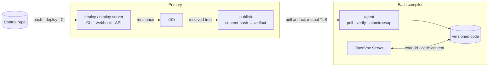

# codavox

[](https://github.com/miharp/codavox/actions/workflows/ci.yml)
[](https://github.com/miharp/codavox/actions/workflows/integration.yml)
[](https://github.com/miharp/codavox/releases)
[](LICENSE)

**Code Manager and file sync for open-source OpenVox: versioned Puppet code
distribution, and static catalogs that actually work.**

codavox gets your Puppet code onto every node that compiles catalogs, and lets
each one report exactly which version it is serving. You deploy from your
control repo the way you already do; codavox makes sure every one of those nodes
ends up serving identical, fully resolved code, and can prove which version that
is. That holds for fifty compilers, and for a
[single OpenVox Server](docs/production.md#a-primary-that-compiles-its-own-catalogs),
where static catalogs stay inert until something answers for the code version.
OpenVox ships the hook, but nothing that fills it.

**Status: early development.** The whole chain works and is exercised on every
push to `main` against real OpenVox Server processes: a deploy runs r10k and
distributes the result, a compiler that missed a deploy catches up on its own,
an agent receives a catalog stamped with the exact code version, and revoking a
compiler's certificate cuts off its access to code. The one place untrusted
bytes are parsed (unpacking a downloaded artifact) is fuzzed nightly.

It ships as rpm and deb for `linux/amd64` and `linux/arm64`, with systemd units
and a Puppet module ([miharp/puppet-codavox](https://github.com/miharp/puppet-codavox))
to configure it. What "early" still means: the version numbers are `0.x` and
the on-disk layout may yet change, and it has not run anywhere but a test
estate.

## Install

```console
# RPM: Rocky, RHEL, AlmaLinux, CentOS Stream
curl -fsSL https://mikeharp.com/codavox/rpm/codavox.repo -o /etc/yum.repos.d/codavox.repo
dnf install codavox
```

```console
# DEB: Debian, Ubuntu
curl -fsSL https://mikeharp.com/codavox/codavox.asc -o /etc/apt/keyrings/codavox.asc
echo "deb [signed-by=/etc/apt/keyrings/codavox.asc] https://mikeharp.com/codavox/deb stable main" > /etc/apt/sources.list.d/codavox.list
apt-get update && apt-get install codavox
```

The repository serves `amd64` and `arm64` and is rebuilt from the
[releases page](https://github.com/miharp/codavox/releases) on every release.
The package installs `/usr/bin/codavox` and the symlinks OpenVox Server invokes.
See [installation.md](docs/installation.md) for what is signed, how to pin a
version, and installing by URL on a host that cannot reach the repository. To
build from source instead, see [Development](#development).

## Your first server

One OpenVox Server that compiles its own catalogs, serving its own code with a
`code_id` in every catalog. That is the base of every larger estate, and
compilers are added to it afterwards. [docs/first-server.md](docs/first-server.md)
sets it up in eight steps, each run by hand before it was written down, and says
which one must not be rushed. For production, or more than one node, use the
[miharp/puppet-codavox](https://github.com/miharp/puppet-codavox) module and
read [production.md](docs/production.md).

## Coming from Puppet Enterprise?

If you have run Code Manager, you already know the model. codavox is the same
shape for open-source OpenVox Server, which ships the hook file sync relies on,
but not file sync or Code Manager themselves.

| In Puppet Enterprise | In codavox |
|---|---|
| `puppet-code deploy production` | `codavox deploy production` |
| Code Manager webhook and API | `codavox deploy-server` (push webhook + `POST /v1/deploys`) |
| file sync, primary → compilers | `codavox publish` on the primary, `codavox agent` on each compiler |
| static catalogs and their `code_id` | the same: codavox implements the same contract |
| Code Manager runs r10k centrally | codavox runs r10k too, then distributes the result |

The main difference: compilers **pull** (poll) rather than being pushed to, so a
compiler that was offline during a deploy catches up on its own, with no event to
replay and no way to silently miss one.

## A few terms

- **Environment**: a named set of Puppet code, such as `production`, built from
  a branch of your control repo. As everywhere in Puppet.
- **Static catalog**: a Puppet feature that keeps an agent's file content
  matched to the catalog it was compiled against, even if the code changes
  mid-run. See [static-catalogs.md](docs/static-catalogs.md).
- **`code_id`**: the identifier for that exact version. In codavox it is a
  content hash of the fully resolved code, so identical code always has the same
  `code_id`, on every compiler.
- **Publisher and agent**: the publisher runs on your primary and serves
  versioned code; the agent runs on each compiler and pulls it.

## Static catalogs

A **static catalog** pins the file content an agent fetches mid-run to the exact
code version its catalog was compiled against, so a deploy landing while an
agent is running cannot hand it a mix of old and new files. OpenVox Server ships
the hook for this but nothing plugged into it, so out of the box the guarantee
silently does nothing.

**codavox is what plugs in.** It distributes the *resolved* tree r10k built and
answers both of the server's two questions (`code-id` and `code-content`) the
same way on every compiler, and never falls back to a wrong version. See
[static-catalogs.md](docs/static-catalogs.md) for what static catalogs actually
need, the settings that look like they enable them and do not, and how to check
whether any of this is working on your servers.

## How a deploy flows



1. You run `codavox deploy production`, or push to your control repo, or call
   the deploy API.
2. codavox runs **r10k** once to resolve the code into a basedir,
   exactly as you do today. codavox does not replace r10k; it distributes what
   r10k produces.
3. It content-hashes that resolved tree into a `code_id` and packages it as an
   immutable artifact.
4. Each compiler's agent polls, downloads the new artifact, verifies it against
   the `code_id`, and atomically switches to it.
5. On every catalog compile, OpenVox Server asks `codavox code-id production`
   and gets the exact version that compiler is serving, in one instant lookup.

Because "which version?" is a content hash every compiler computes the same way,
divergence between compilers becomes visible and self-correcting instead of a
silent bug.

You can see it for the whole fleet at once. Each agent reports what it is
serving (read from the same symlink `code-id` reads) on the poll it already
makes, so the publisher can answer for every compiler:

```console
$ codavox compilers
COMPILER                ENVIRONMENT  CODE_ID       COMMIT        LAST POLL
compiler01.example.com  production   3224ddbe7e3d  a3f1c9e4b2d8  12s ago
compiler02.example.com  production   7b05ff282795  61d70aa9c3e5  9m0s ago
```

The `code_id` is what OpenVox Server pins catalogs to; the commit beside it is
what you recognize, joined from r10k's own deploy record.

## What it guarantees

- **It never serves the wrong version.** Ask a compiler for a version it does
  not have and it fails loudly, rather than quietly serving whatever is current.
  That is the failure static catalogs exist to prevent:

  ```console
  $ codavox code-content production notdeployed manifests/site.pp
  codavox: code version not deployed: notdeployed
  $ echo $?
  1
  ```

- **Compilers converge on their own.** Polling means a compiler that missed a
  deploy catches up on its next tick, with no replayed event and no split brain.
- **Deploys are atomic.** A compiler serves the old version or the new one,
  never a half-written tree.

## Why not r10k per compiler, webhooks, NFS, or rsync?

The most obvious alternative is not a transport at all: skip central
distribution and run r10k independently on every compiler. That fails for a
reason none of the others share. **r10k is not deterministic across time.** A
Puppetfile with `:latest`, or any branch ref, can resolve differently between
two runs, so two compilers running r10k an hour apart can produce different
code from the same control-repo commit. No amount of triggering it well fixes
that; the code has already diverged before distribution enters the picture.
That is why codavox distributes the resolved tree r10k produces, rather than
re-running r10k per compiler.

The usual ways to move that tree around each give something up too: webhooks
are fire-and-forget, so a compiler that was down misses the deploy for good;
NFS makes catalog compilation itself depend on one fileserver, with no
atomicity; rsync is neither atomic nor versioned. And none of the four can
answer "which exact version is this compiler serving?", so divergence cannot
even be detected. codavox distributes versioned, content-addressed code and
answers that question by design. See [design.md](docs/design.md#the-trap-that-kills-the-obvious-design)
for the full rationale.

## Documentation

| document | contents |
|---|---|
| [first-server.md](docs/first-server.md) | One OpenVox Server serving its own code, step by step, and how to add a compiler |
| [production.md](docs/production.md) | Running it for real: ports, sizing, failure modes, rollout, and monitoring |
| [configuration.md](docs/configuration.md) | The shared config file: location, precedence, and every setting |
| [deploying.md](docs/deploying.md) | `codavox deploy`: r10k, the reseal trigger, `--wait` |
| [deploy-server.md](docs/deploy-server.md) | The deploy API and push webhook; deploy status and history |
| [publishing.md](docs/publishing.md) | Running the publisher and its mutual TLS |
| [agent.md](docs/agent.md) | The compiler-side agent: verification, atomic swap, cleanup |
| [static-catalogs.md](docs/static-catalogs.md) | What static catalogs are, the four settings people confuse, and how to check |
| [sealing.md](docs/sealing.md) | How a `code_id` is derived from a tree, and what is excluded |
| [commands.md](docs/commands.md) | Command reference, exit codes, and OpenVox Server wiring |
| [performance.md](docs/performance.md) | Per-deploy benchmarks and the acceptance timing harness |
| [design.md](docs/design.md) | Architecture, trade-offs, and known hard parts |
| [versioned-code-contract.md](docs/versioned-code-contract.md) | The verified OpenVox Server interface codavox implements |
| [test/integration/](test/integration/README.md) | The Docker harness that tests the whole chain against a real OpenVox Server |

## Development

```console
go build ./cmd/codavox     # build
go test ./...              # test
```

See [CONTRIBUTING.md](CONTRIBUTING.md) for every check CI runs, and
[test/integration/](test/integration/README.md) for the Docker harness that
exercises codavox against a real OpenVox Server, needed for changes to TLS, the
agent's HTTP client, packaging, or the systemd units.

## License

[Apache-2.0](LICENSE)

---

*A* coda *is the passage that brings every performance to the same close, which
is the job: get exactly the same code onto every compiler.*
