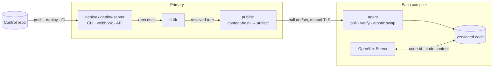

# codavox

**Versioned Puppet code distribution for OpenVox — the open-source answer to
Puppet Enterprise's Code Manager and file sync.**

codavox gets your Puppet code onto OpenVox compilers and lets every compiler
report exactly which version it is serving. You deploy from your control repo
the way you already do; codavox makes sure every compiler ends up serving
identical, fully resolved code — and can prove which version that is.

**Status: early development.** The whole chain works and has run against real
OpenVox Server: a deploy runs r10k and distributes the result, two compilers
converge, a compiler that missed a deploy catches up on its own, and an agent
receives a catalog stamped with the exact code version. It has not yet been
packaged for production use.

## Coming from Puppet Enterprise?

If you have run Code Manager, you already know the model. codavox is the same
shape for open-source OpenVox Server — which ships the hook file sync relies on,
but not file sync or Code Manager themselves.

| In Puppet Enterprise | In codavox |
|---|---|
| `puppet-code deploy production` | `codavox deploy production` |
| Code Manager webhook and API | `codavox deploy-server` (push webhook + `POST /v1/deploys`) |
| file sync, primary → compilers | `codavox publish` on the primary, `codavox agent` on each compiler |
| static catalogs and their `code_id` | the same — codavox implements the same contract |
| Code Manager runs r10k centrally | codavox runs r10k too, then distributes the result |

The main difference: compilers **pull** (poll) rather than being pushed to, so a
compiler that was offline during a deploy catches up on its own — no event to
replay, no way to silently miss one.

## A few terms

- **Environment** — a named set of Puppet code, such as `production`, built from
  a branch of your control repo. As everywhere in Puppet.
- **Static catalog** — a catalog that records the exact code version and file
  checksums, so an agent applies one consistent snapshot even if the code
  changes mid-run. Making these reliable is codavox's whole job. (A Puppet
  feature; OpenVox Server ships the interface for it.)
- **`code_id`** — the identifier for that exact version. In codavox it is a
  content hash of the fully resolved code, so identical code always has the same
  `code_id`, on every compiler.
- **Publisher and agent** — the publisher runs on your primary and serves
  versioned code; the agent runs on each compiler and pulls it.

## How a deploy flows



1. You run `codavox deploy production` — or push to your control repo, or call
   the deploy API.
2. codavox runs **r10k** once to resolve the code into a staging directory,
   exactly as you do today. codavox does not replace r10k; it distributes what
   r10k produces.
3. It content-hashes that resolved tree into a `code_id` and packages it as an
   immutable artifact.
4. Each compiler's agent polls, downloads the new artifact, verifies it against
   the `code_id`, and atomically switches to it.
5. On every catalog compile, OpenVox Server asks `codavox code-id production`
   and gets the exact version that compiler is serving — one instant lookup.

Because "which version?" is a content hash every compiler computes the same way,
divergence between compilers becomes visible and self-correcting instead of a
silent bug.

## Install

Download the package for your architecture from the
[releases page](https://github.com/miharp/codavox/releases) and install it by URL:

```console
# RPM — Rocky, RHEL, AlmaLinux, CentOS Stream
dnf install https://github.com/miharp/codavox/releases/download/v0.1.0/codavox_0.1.0_linux_arm64.rpm
```

```console
# DEB — Debian, Ubuntu
curl -fsSLO https://github.com/miharp/codavox/releases/download/v0.1.0/codavox_0.1.0_linux_arm64.deb
apt-get install -y ./codavox_0.1.0_linux_arm64.deb
```

Pick `arm64` or `amd64` to match the host — OpenVox on Apple silicon is `arm64`.
The package installs `/usr/bin/codavox` and the symlinks OpenVox Server invokes;
see [installation.md](docs/installation.md). To build from source instead, see
[Development](#development).

## Quickstart

Put the `codavox` binary on your primary and each compiler. Then, on the
primary, run the publisher and deploy — the deploy command is the one you know
from `puppet-code`:

```console
# publisher (run as a service), pointed at r10k's basedir
$ codavox publish --staging /etc/puppetlabs/code-staging

# deploy: runs r10k, packages the result, and serves it — waiting until it is live
$ codavox deploy production --wait --staging /etc/puppetlabs/code-staging
production    deployed    a3f1c9e4b2d8    (commit 5f2e9c1)    serving
```

On each compiler, run the agent and point OpenVox Server at codavox:

```console
# converge this compiler onto whatever the publisher serves (run as a service)
$ codavox agent --publisher https://puppet.example.com:8150

# what version is this compiler serving right now?
$ codavox code-id production
a3f1c9e4b2d8
```

For push-to-deploy and CI, run `codavox deploy-server` on the primary: a push
webhook and a token-authenticated deploy API with status and history, the way
Code Manager's webhook and API work. Settings shared across these commands —
staging directory, SSL paths, r10k — go in one [config file](docs/configuration.md).

## What it guarantees

- **It never serves the wrong version.** Ask a compiler for a version it does
  not have and it fails loudly, rather than quietly serving whatever is current
  — the exact failure static catalogs exist to prevent:

  ```console
  $ codavox code-content production notdeployed manifests/site.pp
  codavox: code version not deployed: notdeployed
  $ echo $?
  1
  ```

- **Compilers converge on their own.** Polling means a compiler that missed a
  deploy catches up on its next tick — no replayed event, no split brain.
- **Deploys are atomic.** A compiler serves the old version or the new one,
  never a half-written tree.

## Why not webhooks, NFS, or rsync?

The usual ways to get code onto compilers each give something up: webhooks are
fire-and-forget, so a compiler that was down misses the deploy for good; NFS
makes catalog compilation itself depend on one fileserver, with no atomicity;
rsync is neither atomic nor versioned. And none of them can answer "which exact
version is this compiler serving?", so divergence cannot even be detected.
codavox distributes versioned, content-addressed code and answers that question
by design. See [design.md](docs/design.md) for the full rationale.

## Documentation

| document | contents |
|---|---|
| [configuration.md](docs/configuration.md) | The shared config file: location, precedence, and every setting |
| [deploying.md](docs/deploying.md) | `codavox deploy`: r10k, the reseal trigger, `--wait` |
| [deploy-server.md](docs/deploy-server.md) | The deploy API and push webhook; deploy status and history |
| [publishing.md](docs/publishing.md) | Running the publisher and its mutual TLS |
| [agent.md](docs/agent.md) | The compiler-side agent: verification, atomic swap, cleanup |
| [sealing.md](docs/sealing.md) | How a `code_id` is derived from a tree, and what is excluded |
| [commands.md](docs/commands.md) | Command reference, exit codes, and OpenVox Server wiring |
| [performance.md](docs/performance.md) | Per-deploy benchmarks and the acceptance timing harness |
| [design.md](docs/design.md) | Architecture, trade-offs, and known hard parts |
| [versioned-code-contract.md](docs/versioned-code-contract.md) | The verified OpenVox Server interface codavox implements |

## Development

```console
go build ./cmd/codavox     # build
go test ./...              # test
```

See [CONTRIBUTING.md](CONTRIBUTING.md) for the full checks CI runs.

## License

[Apache-2.0](LICENSE)

---

*A* coda *is the passage that brings every performance to the same close — which
is the job: get exactly the same code onto every compiler.*
